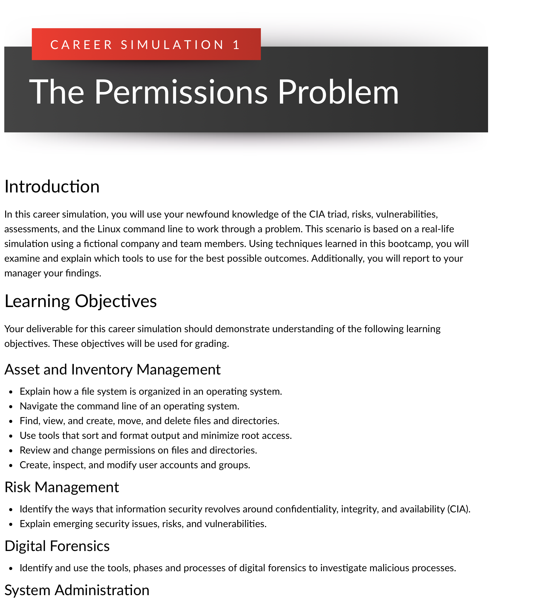
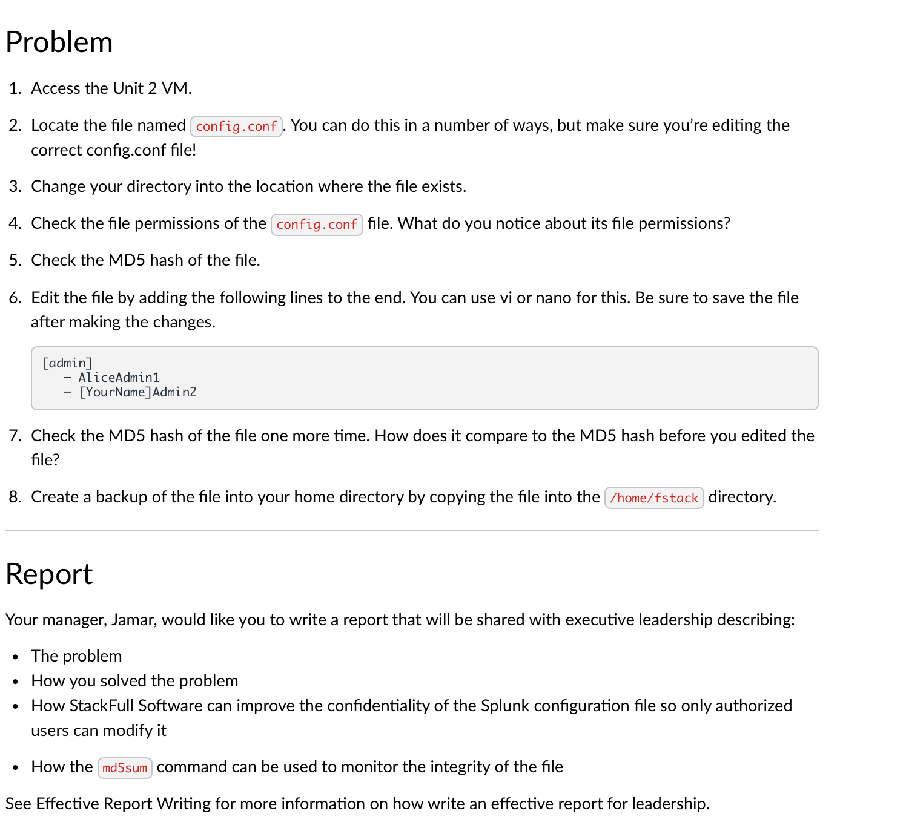
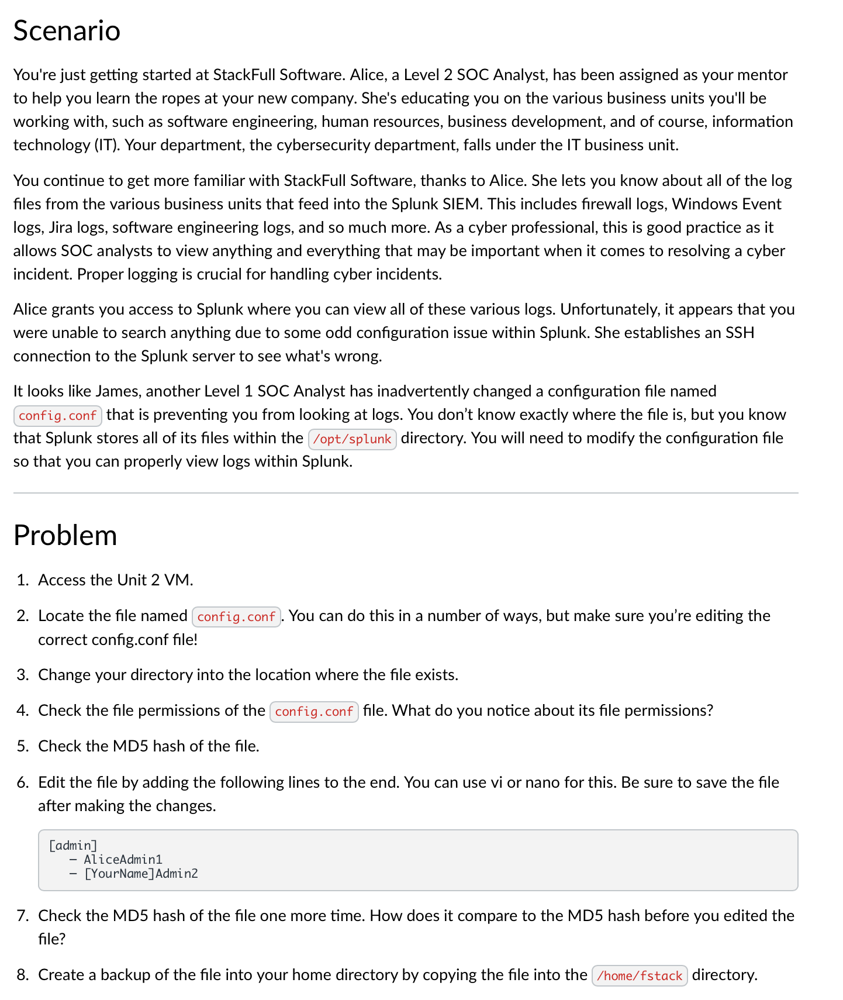

# 🧩 Career Simulation 1 – The Permissions Problem

This simulation focused on Linux file permissions, risk identification, and command-line usage. The task involved resolving a configuration error affecting system security and documenting integrity validation using MD5 hashing.

## 🧠 Key Skills Demonstrated
- Linux Command-Line Navigation
- File System Structure & Permission Management
- MD5 Hashing For Integrity Validation
- Risk Analysis And Reporting

## 📄 Solution
[View PDF Report](./Career-Simulation-1-Solution.pdf)

## 📸 Screenshots
  
  

