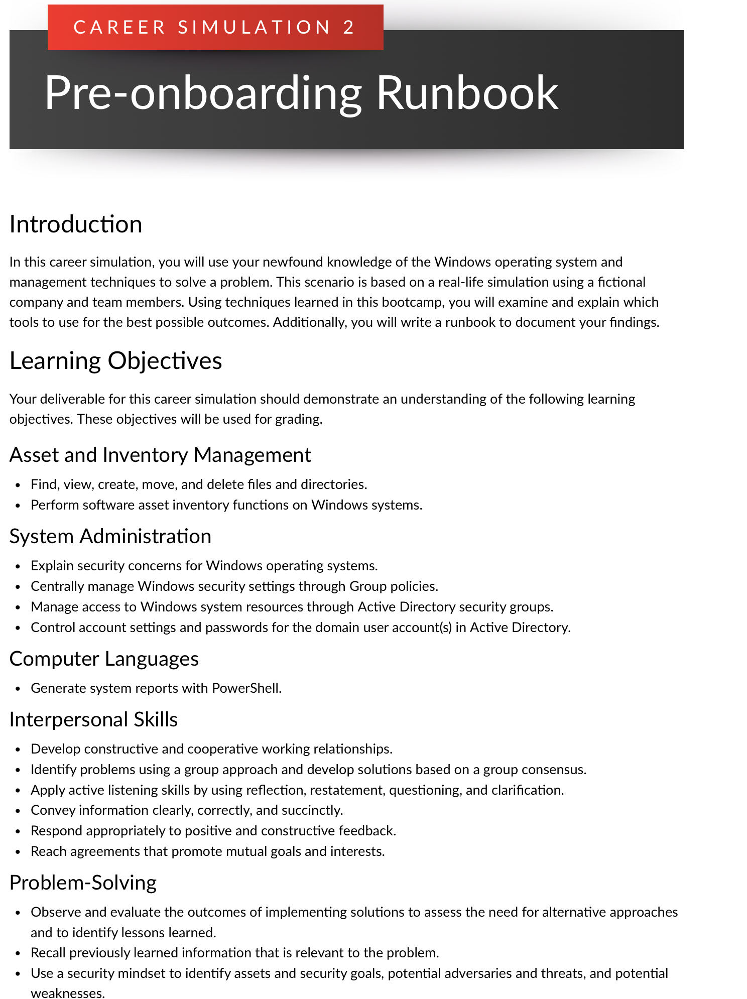
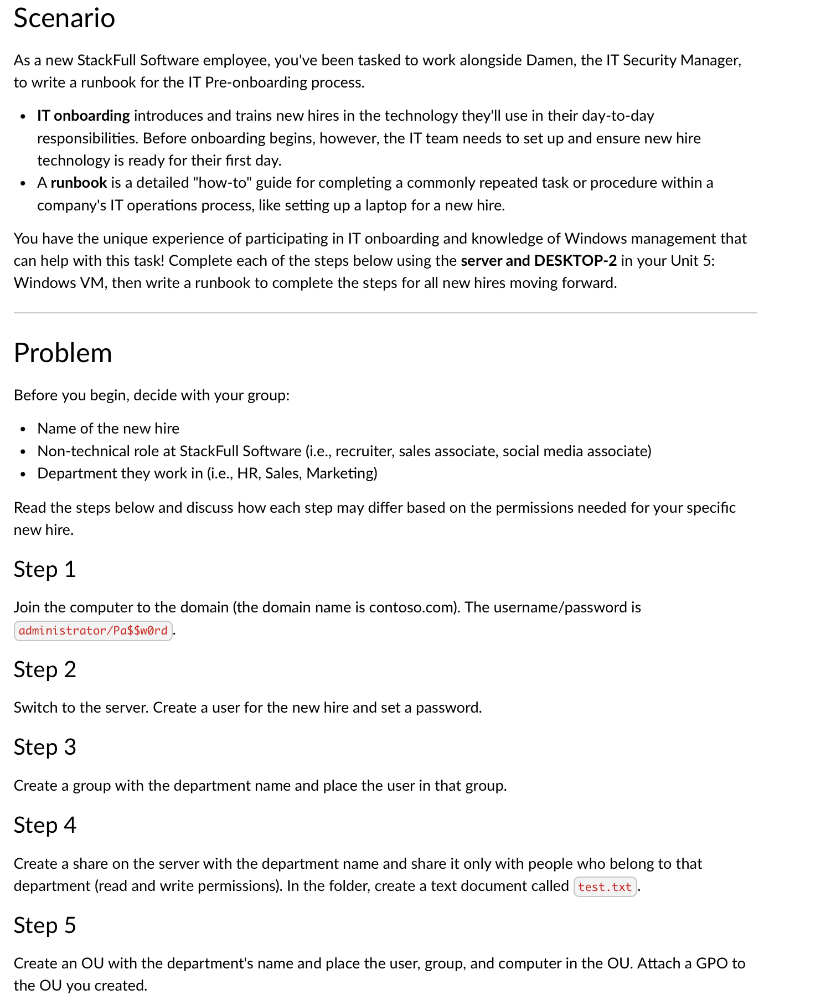
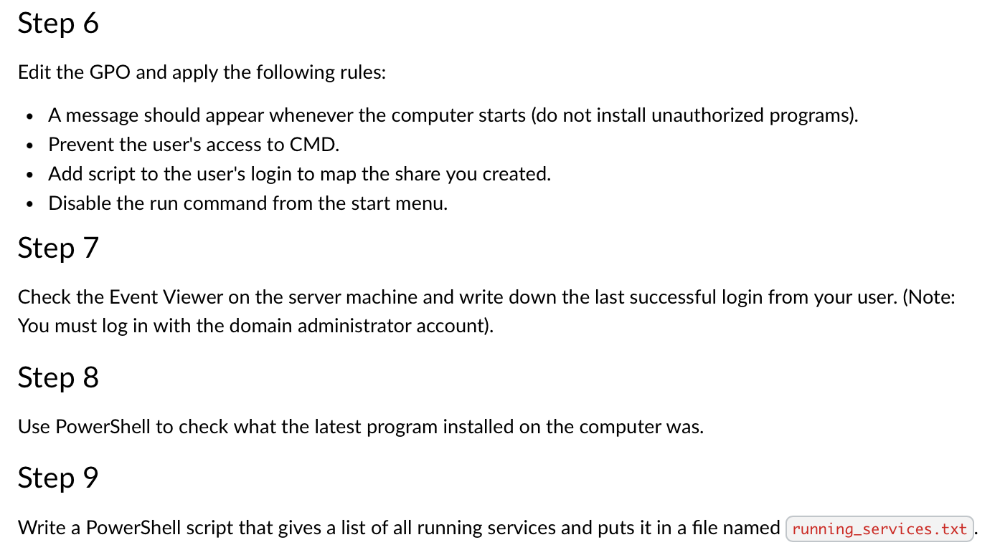

# 💼 Career Simulation 2 – Pre-Onboarding Runbook

This simulation required creating a runbook to streamline IT onboarding using Windows OS. It involved Active Directory management, GPO configurations, PowerShell scripting, and user permission management.

## 🧠 Key Skills Demonstrated
- Active Directory & Group Creation
- GPO Configuration
- OU Structure & Resource Permissioning
- PowerShell Scripting
- IT Onboarding Process Documentation

## 📄 Solution
[View Runbook PDF](./Career-Simulation-2-Runbook.pdf)

## 📸 Screenshots
  
  

