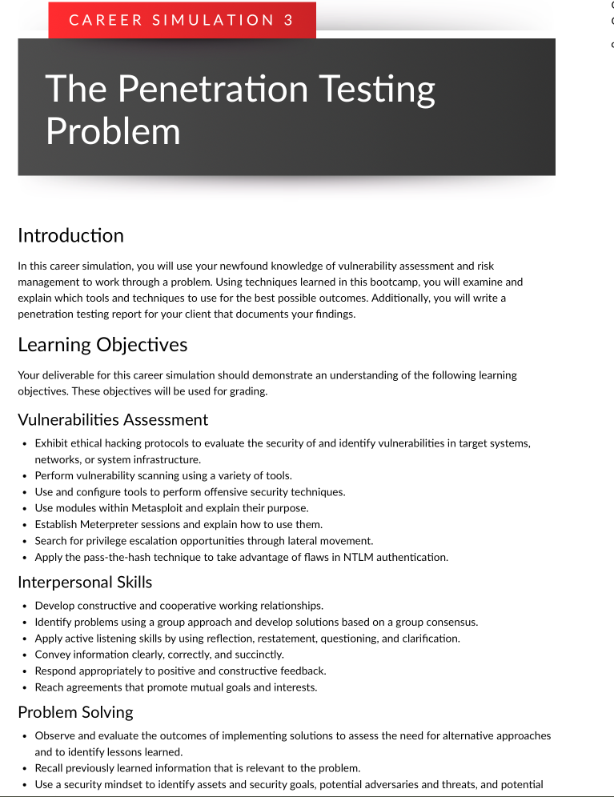
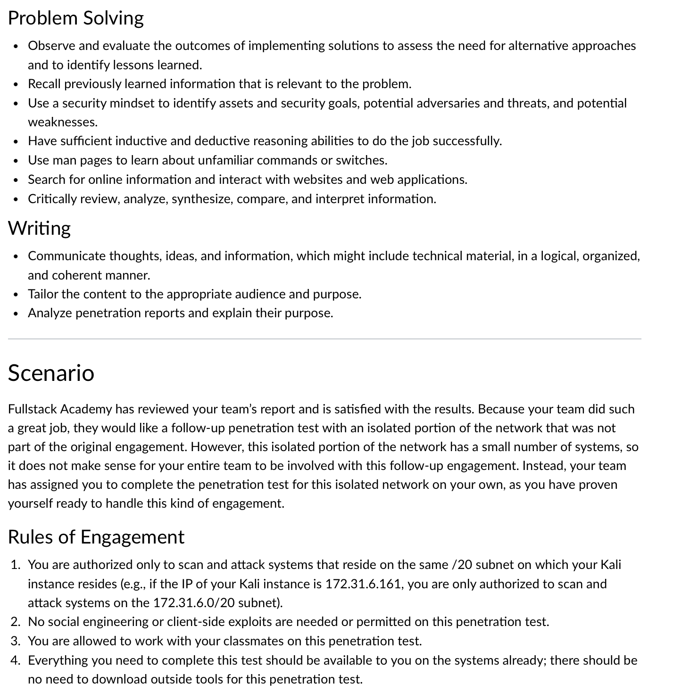
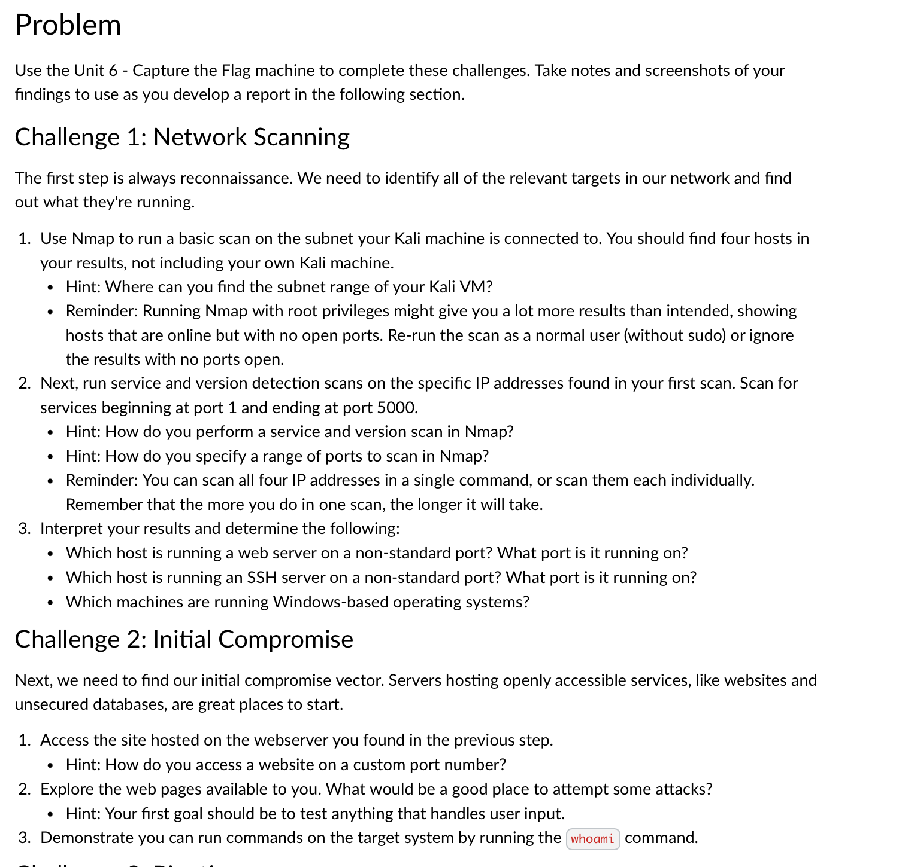
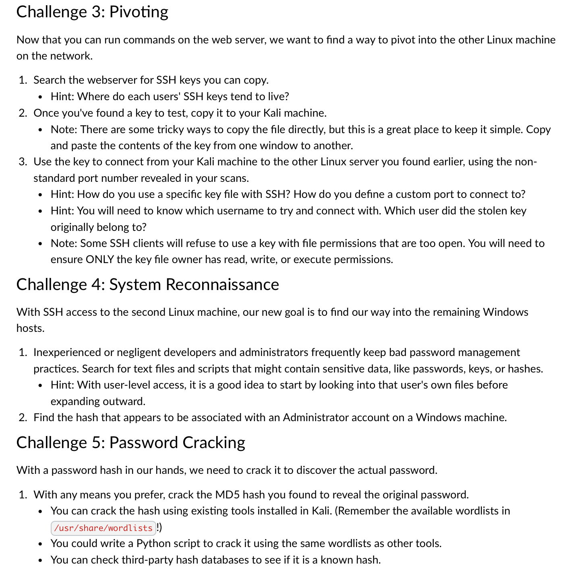
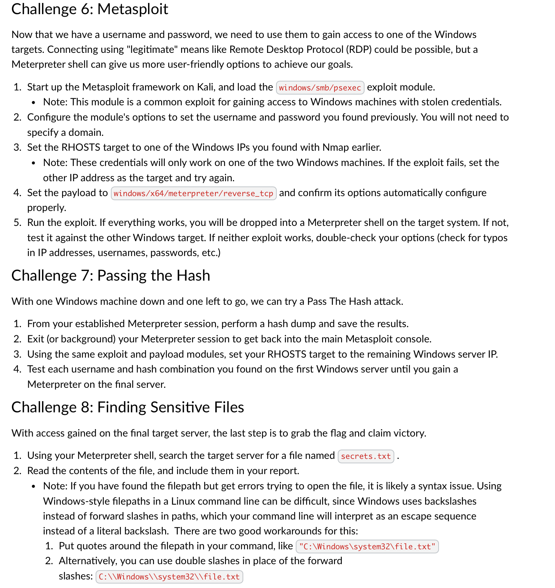

# 🛡️ Career Simulation 3 – The Penetration Testing Problem

This simulation was a solo offensive security challenge to identify and exploit vulnerabilities in a controlled network environment. Tasks included scanning, initial access, privilege escalation, and password cracking.

## 🧠 Key Skills Demonstrated
- Nmap Scanning & Enumeration
- Exploitation Via Web & SSH
- Lateral Movement & Pivoting
- Password Hash Cracking (MD5)
- Writing And Analyzing Penetration Testing Reports

## 📄 Solution
[View Penetration Testing Report (PDF)](./Career-Simulation-3-Pen-Test-Report.pdf)

## 📸 Screenshots
  
  
  

